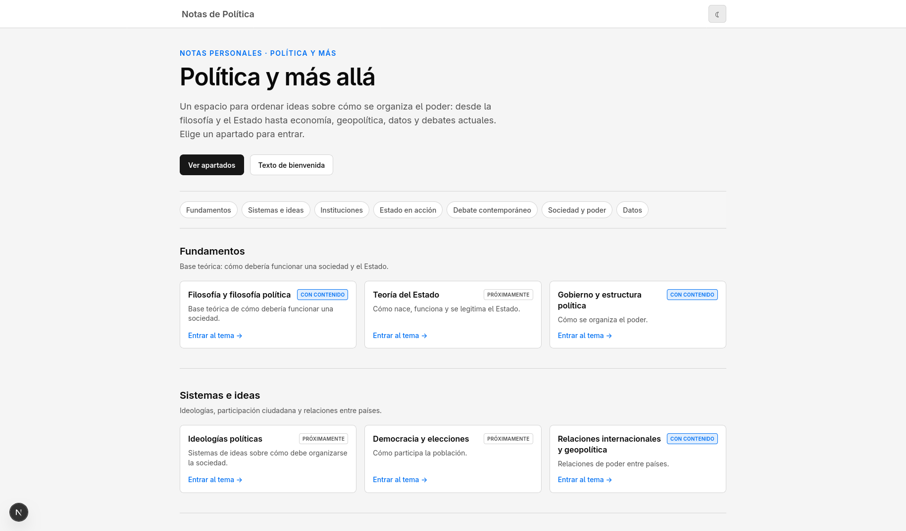

# Web Prosperity

This document is in English. [Versión en español](./README.md)

**Web Prosperity** is a space for the **pursuit of a nation’s prosperity**, explored in a broad sense — **politics, philosophy**, and related topics — built with [Next.js](https://nextjs.org).



## Project documentation

All technical docs live in **[docs/en/overview.md](./docs/en/overview.md)** ([Spanish version](./docs/es/overview.md)).

## Features

- **25 topic sections** in 7 groups (philosophy, geopolitics, economics, data, etc.) with *With content*, *In progress*, and *Coming soon* states
- **Landing** at `/` with hero, anchor navigation, and topic cards
- **Feature-based architecture** — one folder per topic (`src/features/{topic}/`) with TSX hub, own sidebar, and Markdown notes
- **Dynamic routes** `/{topic}` and `/{topic}/...` resolving TSX pages or `.md` notes automatically
- **Light/dark theme** persisted via `next-themes`, toggle in the header
- **Per-topic styling** — grayscale palettes by topic group
- **Search** within each topic’s docs (title, description, URL, and section)
- **Rich Markdown** with tables, lists, and GFM (`react-markdown`, `remark-gfm`)
- **Interactive map** on World statistics (MapLibre GL / [mapcn](https://mapcn.vercel.app/docs))
- **Static export** (`output: 'export'` → `out/`) for Vercel or GitHub Pages
- **Bilingual technical docs** in `docs/es/` and `docs/en/`

## Technologies

| Area      | Stack                                                                         |
| --------- | ----------------------------------------------------------------------------- |
| Framework | [Next.js 15](https://nextjs.org) (App Router) · [React 19](https://react.dev) |
| Language  | [TypeScript](https://www.typescriptlang.org)                                  |
| Styling   | [Tailwind CSS 4](https://tailwindcss.com) · per-topic CSS tokens              |
| Content   | `gray-matter` · `react-markdown` · `remark-gfm`                               |
| UI        | `next-themes` · [Lucide](https://lucide.dev) · `clsx` / `tailwind-merge`      |
| Maps      | [MapLibre GL](https://maplibre.org)                                           |
| Quality   | ESLint · Prettier · `react-doctor`                                            |
| Packages  | [pnpm](https://pnpm.io)                                                       |

## Quick start

```bash
pnpm install
pnpm dev
```

[http://localhost:3000](http://localhost:3000) — build, lint, and env vars: [development.md](./docs/en/development.md).

## Structure (summary)

```text
/
├── docs/es/overview.md   # technical docs (Spanish)
├── docs/en/overview.md   # technical docs (English)
├── src/
│   ├── app/              # App Router routes (/, /[topic], /[topic]/...)
│   ├── features/         # one folder per topic + content/ for .md notes
│   ├── components/
│   └── lib/temas/        # registry.ts, navigation, skins
└── public/
```

## Information

|             |                                                                       |
| ----------- | --------------------------------------------------------------------- |
| **Project** | Space for the pursuit of a nation’s prosperity; notes under active development, growing per topic |
| **Author**  | Fravelz                                                               |
| **License** | [Apache License 2.0](./LICENSE)                                       |

Architecture, topics, content, and deploy details: [docs/en/overview.md](./docs/en/overview.md).
